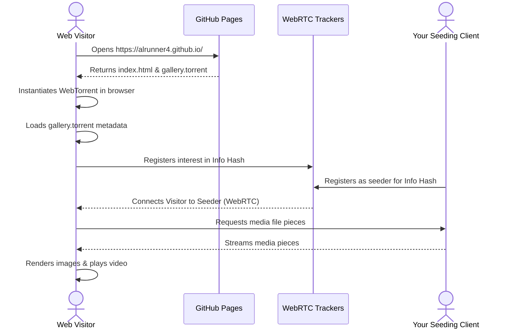

# AetherStream - WebTorrent P2P Media Gallery

AetherStream is a serverless, decentralized photo and video gallery prototype designed to run on **GitHub Pages**. Instead of serving bandwidth-heavy media files from GitHub's servers, AetherStream downloads and streams media directly from the BitTorrent P2P network (via WebRTC) using **WebTorrent**.

The GitHub Pages site only hosts the lightweight web client (`index.html`) and the torrent metadata file (`gallery.torrent`). The actual media content is delivered by you (or other peers) running a seeder.

---

## Repository Structure

*   **`index.html`**: The client application. It loads WebTorrent in the browser, fetches the torrent file, connects to the WebRTC trackers, streams media files, and provides a responsive UI for viewing photos (with lightbox) and playing videos.
*   **`gallery.torrent`**: The compiled torrent metadata file generated by the Nix build process.
*   **`gallery-media/`**: A local folder containing the images and videos you wish to showcase. **This directory is ignored by Git** (via `.gitignore`) to prevent uploading heavy media files to GitHub.
*   **`default.nix`**: The Nix configuration file that installs `mktorrent` and compiles your `gallery.torrent` file securely in a sandbox.
*   **`Makefile`**: Handy shortcuts to run Nix tasks and manage your workspace.

---

## How to Run & Deploy the Prototype

### 1. Populate Your Media
Put the photos (JPG, PNG, WebP) and videos (MP4, WebM) you want to display inside the local `gallery-media/` directory.

> [!NOTE]
> The directory currently contains three generated high-quality sample images and a 5-second video generated using FFmpeg so you can test the build process immediately.

### 2. Build the Torrent File (Nix-based)
To hash your local media and compile the `gallery.torrent` file, run the following command in your terminal:

```bash
make build-gallery
```

This task will:
1. Run `nix-build` to compile the derivation defined in `default.nix`.
2. Generate `gallery.torrent` with pre-configured public WebRTC trackers (`wss://tracker.openwebtorrent.com`, `wss://tracker.btorrent.xyz`).
3. Extract `gallery.torrent` from the Nix store and place it in the root of your repository.

### 3. Local Testing
To test the site locally, you cannot open `index.html` directly as a `file://` URL because browser security policy restricts file system fetches. Instead, launch a local HTTP server:

```bash
make serve
```

Open your browser and navigate to `http://localhost:8000/`.

### 4. Deploy to GitHub Pages
Commit and push the client page, build configuration, and `.torrent` metadata file to GitHub:

```bash
git add index.html gallery.torrent default.nix Makefile .gitignore README.md
git commit -m "Deploy WebTorrent gallery prototype"
git push origin main
```

Once pushed, GitHub Pages will automatically host the files. Your client will be live at `https://alrunner4.github.io/`.

### 5. Seed the Torrent Swarm
Since GitHub is not hosting your images, WebTorrent visitors will need at least one online peer to download the images from. You can act as the seeder:

1. Download and open [WebTorrent Desktop](https://webtorrent.io/desktop/) (or use any WebRTC-compatible torrent client like `webtorrent-hybrid` in Node.js).
2. Drag and drop the local `gallery-media/` folder into your WebTorrent client.
3. Keep the client open. It will seed the files to the trackers, allowing browser visitors on your website to instantly connect to you and download the gallery!

---

## How It Works Under the Hood



1. **Decentralized Streaming**: The browser uses the `webtorrent.min.js` library to load `gallery.torrent` from GitHub Pages.
2. **P2P Connection**: WebTorrent connects to public WebRTC trackers to locate peers. Since browsers cannot connect to standard TCP/UDP torrent peers without a proxy, it connects to other WebRTC-enabled clients (like WebTorrent Desktop or other browser tabs).
3. **Blob URLs**: As pieces of files are downloaded, WebTorrent automatically creates local browser Blob URLs (e.g. `blob:http://...`) and streams them into standard HTML `` and `<video>` tags.
